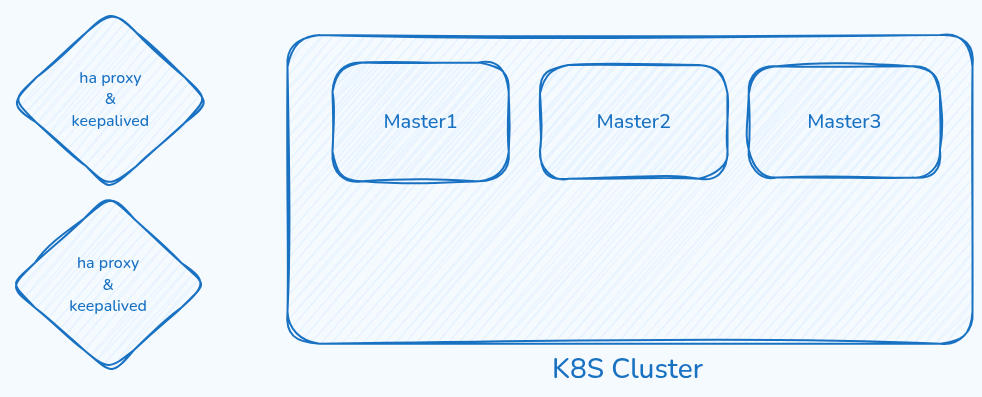

# Kubernetes Voting App Deployment



> _High-level architecture of the voting platform, supporting GitOps, TLS automation, and observability on Kubernetes._

## Overview

This repository contains everything required to deploy a production-ready version of the classic **voting application** on top of a Kubernetes cluster provisioned with [Kubespray](https://github.com/kubernetes-sigs/kubespray). The stack is intentionally opinionated and demonstrates how to combine:

- GitOps-driven delivery with **Argo CD**
- Automated TLS via **cert-manager** and Let's Encrypt
- High availability data services (Redis and PostgreSQL)
- Optional **MinIO** object storage and **Kafka** streaming
- Full observability through the **kube-prometheus-stack**
- Automated image builds with **GitLab CI/CD**

All workloads are packaged as Helm charts so that each component can be installed, upgraded, or rolled back declaratively.

## Repository Layout

| Path | Description |
| ---- | ----------- |
| `voting-app-chart/` | Helm chart that deploys the vote, result, and worker services (frontends, backend processor, ingress, and services). |
| `redis/helm.values.yaml` | Bitnami Redis configuration (persistent storage, probes, metrics service monitor). |
| `postgresql/values.yaml` | Bitnami PostgreSQL HA configuration with PgPool, backups, and metrics. |
| `kafka-chart/` | Lightweight Kafka KRaft Helm chart for optional streaming needs. |
| `minio/helm.values.yaml` | MinIO standalone deployment with HTTPS ingress for API and console. |
| `ingress-nginx/helm.values.yaml` | NGINX Ingress Controller settings tuned for production. |
| `cert-manager/helm.values.yaml` | cert-manager chart values with hooks and Prometheus integration toggles. |
| `argocd/helm.values.yaml` | Argo CD chart values including admin password hash and TLS ingress. |
| `kube-prometheus-stack/` | Values and supporting manifests for Prometheus, Alertmanager, and Grafana. |
| `.gitlab-ci.yaml` | GitLab pipeline that builds and pushes container images for the app services. |
| `Untitled-2024-08-20-1841.excalidraw.png` | Architecture diagram referenced above. |

## Prerequisites

1. **Kubernetes cluster** (v1.28+) created with Kubespray or equivalent, with worker nodes labeled for Linux workloads.
2. **kubectl** and **Helm 3** installed locally and configured to talk to the cluster.
3. A **default storage class** (`local-path` is assumed in the values files) for PVC provisioning.
4. DNS records and ownership of the public domains referenced in the values files (`*.web.echoamir.ir`) or your own customized domains.
5. Public outbound internet access for the cluster to obtain images and ACME certificates.
6. Optional: an SMTP account for Grafana alerting and a GitLab container registry for CI image pushes.

> ℹ️ Replace sample passwords, tokens, and domains in the values files before deploying to a shared or production cluster.

## Deployment Workflow

### 1. Bootstrap Namespaces
```bash
kubectl create namespace ingress-nginx
kubectl create namespace cert-manager
kubectl create namespace argocd
kubectl create namespace redis
kubectl create namespace psql-ha
kubectl create namespace monitoring
kubectl create namespace object-storage
kubectl create namespace voting-app
```
Adjust or add namespaces if you deploy Kafka (`kafka`), MinIO, or other add-ons elsewhere.

### 2. Install Cluster-Wide CRDs
```bash
helm repo add jetstack https://charts.jetstack.io
helm repo add ingress-nginx https://kubernetes.github.io/ingress-nginx
helm repo add argo https://argoproj.github.io/argo-helm
helm repo add bitnami https://charts.bitnami.com/bitnami
helm repo add prometheus-community https://prometheus-community.github.io/helm-charts
helm repo update
```

### 3. Platform Services
Deploy the shared platform dependencies first. Each command expects you to be in the repository root.

```bash
# cert-manager (installs CRDs automatically)
helm upgrade --install cert-manager jetstack/cert-manager \
  --namespace cert-manager \
  --create-namespace \
  --set installCRDs=true \
  -f cert-manager/helm.values.yaml

# NGINX Ingress Controller
helm upgrade --install ingress-nginx ingress-nginx/ingress-nginx \
  --namespace ingress-nginx \
  -f ingress-nginx/helm.values.yaml

# Argo CD GitOps controller
helm upgrade --install argocd argo/argo-cd \
  --namespace argocd \
  -f argocd/helm.values.yaml

# Redis (Bitnami chart)
helm upgrade --install redis bitnami/redis \
  --namespace redis \
  -f redis/helm.values.yaml

# PostgreSQL HA (Bitnami)
helm upgrade --install postgresql bitnami/postgresql-ha \
  --namespace psql-ha \
  -f postgresql/values.yaml
```

Optional components:
```bash
# MinIO object storage
helm repo add minio https://charts.min.io/
helm upgrade --install minio minio/minio \
  --namespace object-storage \
  -f minio/helm.values.yaml

# Kafka (custom chart in this repository)
helm upgrade --install kafka ./kafka-chart \
  --namespace kafka
```

### 4. Observability Stack
Install the monitoring tooling once the base services are reachable.
```bash
helm upgrade --install kube-prometheus-stack prometheus-community/kube-prometheus-stack \
  --namespace monitoring \
  -f kube-prometheus-stack/helm.values.yaml
kubectl apply -f kube-prometheus-stack/manifest.yaml
```
The manifest file seeds HTTP basic authentication secrets for the Alertmanager and Prometheus ingresses.

### 5. Deploy the Voting Application
```bash
helm upgrade --install voting-app ./voting-app-chart \
  --namespace voting-app \
  -f voting-app-chart/values.yaml
```
This chart installs:
- `vote` frontend exposed via `vote.web.echoamir.ir`
- `result` frontend exposed via `result.web.echoamir.ir`
- `worker` backend processor connected to Redis and PostgreSQL

Ensure the referenced container images exist in your registry, or update `values.yaml` with images built from your pipelines.

### 6. Continuous Delivery with Argo CD (Optional)
1. Log in to Argo CD using the ingress endpoint defined in `argocd/helm.values.yaml`.
2. Create an Application that tracks this repository (or a fork) and the desired Helm charts.
3. Configure automated sync policies to keep the cluster aligned with Git.

## Continuous Integration Pipelines
The GitLab pipeline (`.gitlab-ci.yaml`) defines three build jobs—`build-vote`, `build-result`, and `build-worker`—that:
1. Authenticate against the GitLab container registry.
2. Build Docker images for each service using the Dockerfiles located in `voting-app/<service>/` (ensure those directories exist in your CI context).
3. Push images tagged with `v1.0.0` by default.

Update the `VERSION` variable to produce semantic release tags, and mirror the tag within `voting-app-chart/values.yaml` so the Helm release pulls the expected image.

## TLS, Secrets, and Credentials
- cert-manager uses a ClusterIssuer named **`letsencrypt`**; create it before installing the charts or adjust the annotations.
- All provided passwords (Redis, PostgreSQL, MinIO, Grafana, Argo CD) are placeholders. Replace them with secrets stored in a secure vault or Kubernetes secrets.
- The Argo CD admin password is stored as a bcrypt hash in `argocd/helm.values.yaml`. Generate a new hash with `htpasswd -nbBC 10 admin <password>`.
- For Grafana SMTP, create the `grafana-smtp` secret referenced in the monitoring values file.

## Backups and Persistence
- **PostgreSQL** and **Redis** request persistent volumes (`local-path` by default). PostgreSQL enables a daily backup CronJob—configure the object store or NFS target via the Bitnami chart values as needed.
- **MinIO** provisions a persistent volume for object storage and exposes both API (`object.web.echoamir.ir`) and console (`minio.web.echoamir.ir`) endpoints over HTTPS.

## Troubleshooting Tips
- Verify certificate issuance with `kubectl describe certificate -A` if ingresses remain HTTP-only.
- Use `kubectl get events -A --sort-by=.metadata.creationTimestamp | tail` to spot scheduling or probe failures.
- When installing Bitnami charts, ensure the `allowInsecureImages` flag is compatible with your cluster's container runtime policies.
- For image pull failures, confirm GitLab runners pushed the expected tags and that Kubernetes secrets contain the proper registry credentials (if private).

## Contributing
1. Fork the repository and create a feature branch.
2. Make your updates, including documentation changes and Helm chart value adjustments.
3. Run linting or dry-run installs (`helm template ./voting-app-chart`) to validate the manifests.
4. Commit with descriptive messages and open a pull request summarizing the change, tests performed, and relevant context.

## License
No explicit license is provided. If you intend to reuse this work, clarify the licensing terms with the repository owner or add a LICENSE file.
